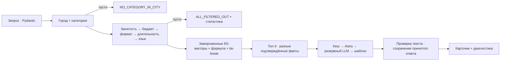

# событие. — понятный выбор подрядчика

Рабочий MVP HackAlem AI, трек #79-lite, команда **The Good The Bad and The Ugly**. По городу, дате, формату, категории и бюджету сервис выбирает до трёх подрядчиков из выбранного каталога и объясняет различия конкретными фактами. Заказчику не нужно заново читать десятки описаний; пустой результат показывает причину и позволяет изменить условия.

Разработка и отчёты находятся в **`demoVer-1`**. Документы шагов 1–2 в `docs/` сохранены как история решений; этот README описывает реализованный продукт.

## Быстрый запуск

### Docker Compose

Нужен Docker с Compose ≥2.24. Первый запуск устанавливает зависимости из сети; его время зависит от загрузки базового образа. После сборки модель и ключи API для запуска не нужны.

```bash
docker compose up --build -d
```

Открыть **http://localhost:8000**. Готовность: http://localhost:8000/health/ready. Кеш сохраняется в Docker volume. Остановка: `docker compose down`; не удаляйте volume перед проверкой повторяемости LLM-ответов.

`.env` необязателен. Без ключей используются настоящие семантические эмбеддинги и проверенные текстовые шаблоны. Dockerfile и проверка контейнера включены в CI. Локальная проверка выполнялась на Python 3.12: Docker в среде разработки отсутствовал, поэтому локальный запуск контейнера не подтверждён.

### Python 3.12+

Из корня репозитория:

```bash
python -m venv .venv
# Windows PowerShell:
.venv\Scripts\Activate.ps1
# macOS / Linux:
# source .venv/bin/activate
python -m pip install -r requirements-dev.txt
python -m uvicorn contractor_matching.api:app --app-dir app --host 127.0.0.1 --port 8000
```

Node, GPU, ONNX и внешний LLM не нужны. Локально переменные задаются в окружении процесса; `.env` автоматически читает только Compose.

```bash
python -m pytest
```

## Возможности

Форма принимает город, дату, формат, категорию, бюджет и необязательные язык/длительность. Карточки показывают цену **от**, конкретное объяснение, дату доступности, синтетику и восстановленные поля. Сравнение дат показывает роль занятости. Диагностика раскрывает причины отсева, компоненты рейтинга и источник текста.

Три исхода различимы: `SUCCESS` с 1–3 карточками и причиной неполной тройки; `NO_CATEGORY_IN_CITY`, если категории нет в городе; `ALL_FILTERED_OUT`, если профили есть, но каждый исключён с численной статистикой.

Данные каталога не подтверждают реальность подрядчика и не обещают бронирование. Доступность означает отсутствие даты в предоставленном `busy_dates`.

## Пайплайн



LLM получает уже выбранные карточки и разрешённые формулировки. Он не меняет состав, порядок или ограничения. Повторяемость решения не зависит от вероятностного текста и доступности сети.

### Фильтры и контракты

Точное равенство города и принадлежность категории; `Зарубежье` никогда не подмешивается. Пул сортируется по ID. Каждому исключённому профилю назначается ровно первая причина в порядке `busy → budget → format → duration → language`. Инвариант `stats.total() == pool_count - eligible_count` проверяется явно.

Пустой `max_hours` проходит любую длительность. Фильтр не обрезает список. Площадки проходят тот же пайплайн. Даты строго `YYYY-MM-DD`, диапазон `2026-09-23`–`2026-12-31`; бюджет конечный положительный, длительность положительная целая. CSV читается через `DictReader`; булевы `True/False` — явным маппингом, массивы — по `|`, пустая длительность — `None`.

### Рейтинг

```text
score = 0.5*cosine + 0.3*(price_from_kzt/budget) + language_term - 0.05*synthetic
language_term = 0.2 при совпадении; 0.1 если язык не задан; 0 при несовпадении
sort_key = (-round(score, 4), price_from_kzt, id)
```

Выдаётся `min(3, eligible_count)`. Формула сохранена из задания: ценовой член поощряет более дорогой вариант внутри бюджета. После языкового фильтра языковой член одинаков для всех оставшихся профилей. Score не является вероятностью качества или оценкой репутации.

Используется готовая [multilingual-e5-small](https://huggingface.co/intfloat/multilingual-e5-small), 384 измерения, [ONNX-версия Xenova](https://huggingface.co/Xenova/multilingual-e5-small/tree/761b726dd34fb83930e26aab4e9ac3899aa1fa78), фиксированная ревизия `761b726dd34fb83930e26aab4e9ac3899aa1fa78`. Это локальный провайдер эмбеддингов без API-ключей. Модель не дообучалась.

В `data/embeddings.json` сохранены векторы 70 профилей и всех **408** комбинаций: 17 категорий × 6 форматов × 4 варианта языка, включая отсутствие. Дата, город и бюджет обрабатываются правилами/формулой. Произвольного текстового запроса нет.

Использованы префиксы `query:`/`passage:`, attention-mask mean pooling и L2-нормализация. Длинные описания разбиваются до 512 токенов; в текущем каталоге разбиение не понадобилось. SHA256 описаний и семантического текста, ревизия модели и хеш артефакта проверяются на старте. Устаревшие векторы блокируют запуск до явной пересборки; скрытого переключения модели нет. Веса не включены в репозиторий.

Пересборка только при изменении каталога/шаблона:

```bash
python -m pip install -r requirements-embeddings.txt
python scripts/build_embeddings.py --model-dir model-cache --download
python -m pytest
```

Потребуется ~136 МБ загрузки. После проверки зафиксируйте оба `embeddings*.json`. Для обычного запуска это не требуется. Манифест содержит версии сборки, ревизию и SHA256 файлов модели.

### Факты, кеш и Astra

`data/facts.json` содержит вручную отобранные утверждения, точные цитаты и SHA256 описаний всех 70 профилей. Факты проверяются на старте и назначаются после ранжирования. Для бедных описаний добавлены конкретные часы/цена и предупреждение, без выдумывания достижений.

Для карточки готовятся 2–3 допустимые фразы. LLM выбирает формулировку среди них: это **ограниченный выбор текста**, а не свободная генерация. Неизвестные утверждения, числа, ID, перестановка карточек и клише отклоняются. Выход: 1–2 предложения, ≤45 слов. Проверены все возможные тройки внутри города/категории.

Инструкция провайдеру: «Не меняйте кандидатов, их порядок или факты. Для каждой карточки выберите ровно одну строку из approved_options. Не добавляйте текст, числа или обещания». Передаются запрос, выбранная цитата и разрешённые формулировки, а не сырой профиль целиком. `temperature=0`.

**Документация и ключи Astra 6 в сессии не предоставлены. Живой вызов Astra не проверен.** Реализован и проверен моками адаптер chat completions с явным включением; URL/model не выдуманы. После сверки с документацией провайдера:

```dotenv
ASTRA_API_PROTOCOL=openai-chat-completions
ASTRA_CHAT_COMPLETIONS_URL=<полный HTTPS endpoint из документации>
ASTRA_MODEL=<точный model ID>
ASTRA_API_KEY_1=<ключ команды>
```

Опционально `ASTRA_API_KEY_2/3`. Общий предел попыток Astra — **2.5 с**, второго провайдера — **1.5 с**, всего запроса — **8 с**. Резервный адаптер: `FALLBACK_LLM_API_PROTOCOL`, `FALLBACK_LLM_CHAT_COMPLETIONS_URL`, `FALLBACK_LLM_MODEL`, `FALLBACK_LLM_API_KEY`. Последний рубеж — конкретный детерминированный шаблон.

SQLite сохраняет принятый набор объяснений и их происхождение, включая шаблон. Ключ включает запрос, профили, факты, версии объяснителя и конфигурацию модели. Повтор получает сохранённые тексты; конкурирующие записи выбирают первый принятый ответ. API-ключи не входят в кеш, логи и фронтенд. Изменение конфигурации создаёт новый ключ кеша.

## Данные

| Набор | Профилей | Синтетических | Происхождение |
|---|---:|---:|---|
| `data/original.csv` | 66 | 13 | Исходный CSV без изменения байтов |
| `data/team_synthetic.csv` | 4 | 4 | 3 декоратора + 1 инструменталист в Астане |
| Всего | 70 | 17 | Отдельное поле `origin` |

SHA256 исходника: `6a724b6b7dfb5973343e68ba18dadb60fc807d87e3d78f03ee86fb26cb089f7d`. Командные профили вымышлены и явно помечены. Цены ориентированы на категории исходника, календари воспроизводимо созданы один раз скриптом `scripts/generate_synthetic.py`. Флористы и сувениры дополнительно не добавлялись.

Восстановленные города/цены и слабые описания показаны в UI. Для HK-77838 (язык) и HK-90009 (минимум аренды) есть предупреждения; расхождения не превращены в придуманные правила. Рейтинги и достижения атрибутируются описанию, а не независимой проверке.

## Демо для жюри

| Пресет | Условия | Ожидаемый результат |
|---|---|---|
| Ведущие · Алматы | 04.10, корпоратив, 2 млн ₸, 6 ч, русский | Пул10, busy5, подходят5, топ-3 |
| Сравнение дат | Те же условия, 04.10 → 05.10 | Подходят5 → 4; другая тройка из-за занятости |
| Декораторы · Астана | 05.10, свадьба, 3 млн ₸, 10 ч, русский | 3 командных синтетических профиля |
| Редкая категория | Алматы, Флорист, 04.10, свадьба, 300 тыс. ₸, 10 ч, русский | 2 карточки; `None` длительность проходит |
| Категории нет | Зарубежье, Ведущий | `NO_CATEGORY_IN_CITY`, пул0 |
| Все вне бюджета | Те же флористы, 100 тыс. ₸ | `ALL_FILTERED_OUT`, budget2 |
| Все заняты | Те же флористы, 01.10, 300 тыс. ₸ | `ALL_FILTERED_OUT`, busy2 |
| Банкетные залы | Алматы, 01.10, свадьба, 4 млн ₸, 8 ч, русский | Пул7, подходят4; busy1, budget1, format1 |

Все даты — 2026 год. [Сценарий выступления](docs/demo-script.md). Произвольные две даты не обязаны давать разные тройки: если доступные кандидаты совпадают, одинаковая выдача корректна. Для демо выбран проверенный пример, без перестановок ради даты.

## Definition of Done

| Критерий ТЗ / исходного запроса | Проверка и состояние |
|---|---|
| Ответ ≤10 с | Сквозные локальные тесты и ограниченные таймауты; холодная сборка образа отдельно |
| До3 конкретных невзаимозаменяемых объяснений | Все70 профилей, лимит слов, различительные факты; реализовано |
| Одинаковый запрос → одинаковый порядок | 20 повторов, tie-break, перезапуск кеша; реализовано |
| Две даты → другая выдача и объяснение занятости | 04/05 октября + причины исключения; реализовано |
| Плотная, редкая и пустая категории | Реальные проверенные пресеты и API tests; реализовано |
| Пустой результат словами | Разные исходы, первая причина и статистика; реализовано |
| Команда объясняет пайплайн | Диагностика, формула, Mermaid и цитаты; реализовано |
| Готовые эмбеддинги без дообучения | Закреплённая E5 + хеши; реализовано |
| LLM только для текста | Проверенный адаптер; живой Astra ожидает API-контракта и ключа |
| Docker и воспроизводимость | Dockerfile, Compose, healthcheck, CI; локально Docker недоступен |

Тесты покрывают причины отсева, инвариант суммы, города, null-safe длительность, булевы строки, неверные даты/типы, формулу, устаревшие эмбеддинги, факты, кеш, таймауты, враждебные ответы LLM и API. Платные внешние API в тестах не вызываются.

## API и файлы

`GET /api/meta` — справочники/пресеты/режимы. `POST /api/search` — подбор. `GET /health/ready` — проверка загрузки. `/openapi.json` — машинный контракт. UI и API на одном origin.

```json
{"city":"Алматы","date":"2026-10-04","event_format":"корпоратив","category":"Ведущий","budget":2000000,"duration":6,"language":"русский"}
```

```text
app/contractor_matching/  модели, фильтры, рейтинг, объяснения, API
app/static/              UI без сборки и CDN
data/                    CSV, факты, готовые векторы
scripts/                 подготовка данных и эмбеддингов
tests/                   ядро, API, отказы, детерминизм
docs/                    аудит, архитектура, демо
```

MVP рассчитан на небольшой каталог и один worker; кеш хранится на диске. Семантическая полезность весов на реальных пользовательских выборах пока не оценивалась. Публичный многопользовательский запуск потребует отдельной эксплуатационной подготовки.

## Что сознательно не делали

Бронирование, заявки, уведомления, расширение выдачи другими городами и дообучение на 66 записях исключены заданием. Не добавляли чат, кабинет и сложные анимации: приоритет у фактов, честных отказов и скорости. Следующие улучшения — актуализация календарей/цен и оценка рекомендаций на размеченных запросах; Astra включается после получения фактического API-контракта.
